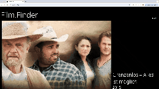
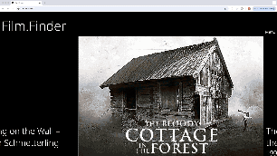
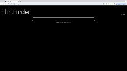
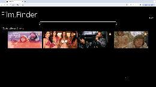

# FilmFinder

## Running the project

1. Clone the project.
2. Run `npm install`
3. Create a `.env.local` file.

```
{
MONGODB_URI=""
NEXT_PUBLIC_TMDB_KEY=""
NEXT_PUBLIC_NETZKINO_KEY=""
GITHUB_ID=""
GITHUB_SECRET=""
NEXTAUTH_URL=http://localhost:3000
NEXTAUTH_SECRET=""
}
```

Now run the server:

```
npm run dev
```

Open [http://localhost:3000](http://localhost:3000) with your browser to see the result.

## Overview 

A website that allows to research and save movies.

## Features

-   Carousel with randomly picked movies of the day
-   Search function for movie
-   Login
-   Favorite movies

## Technologies

|                                                                                                                       |           |                                                                                                |            |
| --------------------------------------------------------------------------------------------------------------------- | --------- | ---------------------------------------------------------------------------------------------- | ---------- |
| [](https://developer.mozilla.org/en-US/docs/Web/CSS)      | CSS       | [](https://developer.mozilla.org/en/TypeScript) | Typescript |
| [](https://react.dev/)                                  | React     | []([https://nodejs.org/en](https://nextjs.org/))      | Next.js  

## Preview
### Carousel: Movie Of The Day



### Login




### Search Movies



### Favorite Movies




